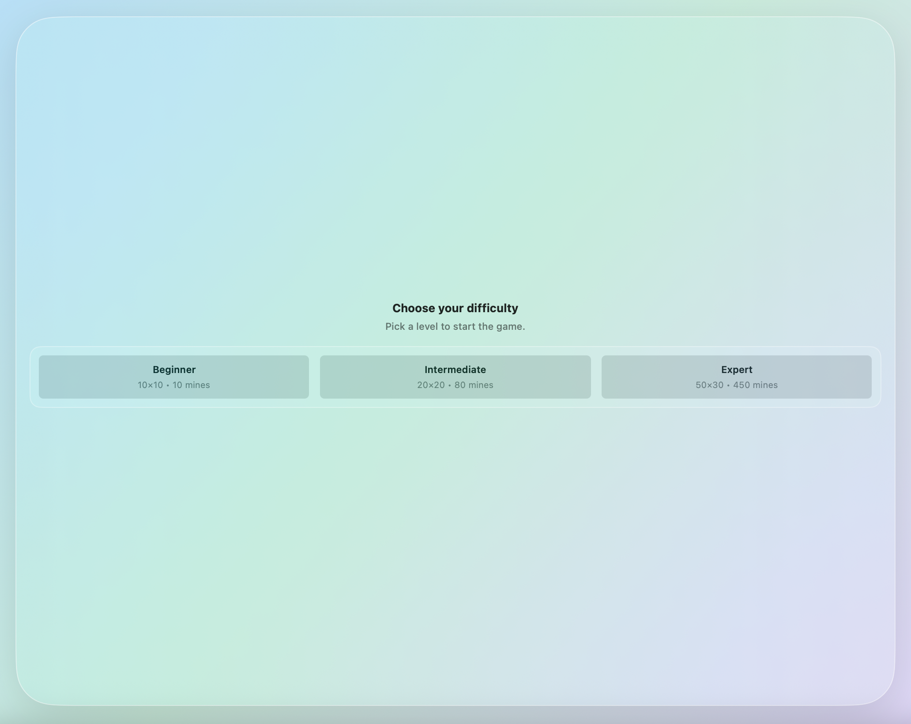
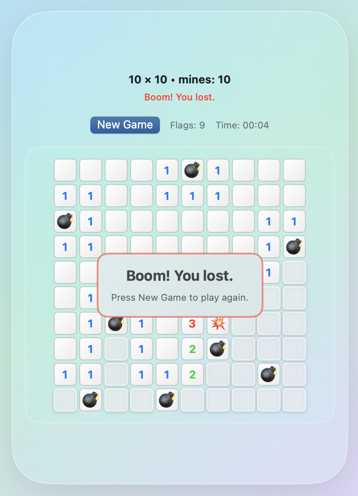

# MinesweeperMac (Codex Test Project)

This repository contains a macOS Minesweeper clone written in SwiftUI. It is a **test project built with the help of Codex** and serves as a compact, well-structured example of classic Minesweeper rules and UI on macOS.

## Highlights

- macOS app built with Swift 5+ and SwiftUI
- Game logic is UI-independent (`/Game`)
- SwiftUI views are separated in `/Views`
- Classic Minesweeper rules with safe first click and flood fill
- Multiple difficulty presets
- Right-click flagging and double-click chord reveal

## How the Game Works

- **Goal:** Reveal all non-mine cells.
- **Mines:** Hidden across the grid according to the selected difficulty.
- **Numbers:** Each revealed cell shows how many mines touch it (8 neighbors).
- **Flags:** Right-click a cell to toggle a flag. Flags prevent accidental reveal.
- **Chord (double click):** Double-click a revealed numbered cell to open all adjacent cells **only if** the number of adjacent flags equals the number on the cell.
- **First click safety:** The first revealed cell is never a mine, and the 8 neighboring cells are also kept mine-free.
- **Win:** All non-mine cells are revealed.
- **Loss:** Revealing a mine ends the game. The triggered mine shows a distinct explosion icon.

## Difficulty Levels

- **Beginner:** 10 × 10, 10 mines
- **Intermediate:** 20 × 20, 80 mines
- **Expert:** 50 × 30, 450 mines

## UI Notes

- Liquid Glass styling with translucent panels and gradients
- The window resizes to fit the full grid for the selected difficulty
- New Game recreates the board using the current difficulty

## Screenshots




## Build & Test

From the project root:

```bash
xcodebuild -scheme MinesweeperMac -destination 'platform=macOS' build
xcodebuild -scheme MinesweeperMac -destination 'platform=macOS' test
```

## Project Layout

- `Minesweeper/Game` — core logic (Board, Cell, Game state)
- `Minesweeper/Views` — SwiftUI views (ContentView, BoardView, CellView)

## Credits

This Minesweeper clone is a **Codex-assisted test project** created to explore SwiftUI UI patterns and classic game rules on macOS.
